<p align="center">
  
</p>

<p align="center">
  <a href="https://fufufarizz.vercel.app" target="_blank" rel="noopener noreferrer">
    
  </a>
  &nbsp;
  <a href="https://www.linkedin.com/in/faris-salman-azhari-78bb06416/" target="_blank" rel="noopener noreferrer">
    
  </a>
  &nbsp;
  <a href="mailto:farissalman101010@gmail.com">
    
  </a>
</p>

```text
╭────────────────────────── faris@ui-id:~$ fastfetch ──────────────────────────╮
│                                                                              │
│       /\         user        faris@ui-id                                     │
│      /  \        host        Universitas Indonesia (Information Systems)     │
│     /\   \       role        Developer • Cybersecurity • Product Builder     │
│    /      \      status      Building useful things and breaking them        │
│   /   ,,   \     stack       Python • TypeScript • Go • Kali/Linux • C/C++   │
│  /   |  |  -\    focus       AppSec • Web Exploitation • System Arch         │
│ /_-''    ''-_\   uplink      https://fufufarizz.vercel.app                   │
│                                                                              │
╰──────────────────────────────────────────────────────────────────────────────╯
```

---

### ⚡ Interactive Terminal Shell

<details open>
<summary><b>▶ <code>cat /arsenal/tech_stack.md</code></b> <i>(Click to toggle Arsenal)</i></summary>
<br/>

#### 🛡️ Cybersecurity & Forensics
<p align="left">
  
  
  
  
  
  
</p>

#### 💻 Programming Languages & Shell
<p align="left">
  
  
  
  
  
  
  
</p>

#### ⚙️ Web Dev & Frameworks
<p align="left">
  
  
  
  
  
</p>

#### 🛠️ Tools, Cloud & Environments
<p align="left">
  
  
  
  
  
</p>

</details>

<details open>
<summary><b>▶ <code>run /analytics/github_metrics.sh</code></b> <i>(Click to toggle Stats)</i></summary>
<br/>

<p align="center">
  
  
</p>

<p align="center">
  
</p>

</details>

<details>
<summary><b>▶ <code>cat /sys/mission_status.log</code></b> <i>(Click to toggle Mission)</i></summary>
<br/>

```ini
[SYSTEM_LOG]
Status        = Active
University    = Universitas Indonesia (UI ID)
Major         = Information Systems (Sistem Informasi)
Primary_Goal  = Engineering high-reliability software & offensive/defensive cybersecurity.
Current_Focus = Web Application Security, Product Engineering, Secure Architectures.
Philosophy    = "Building useful things and occasionally breaking them."
```

</details>

<details>
<summary><b>▶ <code>cat /network/uplink_channels.conf</code></b> <i>(Click to toggle Uplinks)</i></summary>
<br/>

| Terminal Protocol | Destination | Status |
| :--- | :--- | :--- |
| **HTTP Uplink** | [🌐 fufufarizz.vercel.app](https://fufufarizz.vercel.app) | `200 OK` |
| **LinkedIn Channel** | [💼 Faris Salman Azhari](https://www.linkedin.com/in/faris-salman-azhari-78bb06416/) | `CONNECTED` |
| **Git Secure Shell** | [🐙 @Ambaturizz](https://github.com/Ambaturizz) | `ACTIVE` |
| **Mail Port** | [✉️ farissalman101010@gmail.com](mailto:farissalman101010@gmail.com) | `LISTENING` |

</details>

---

<p align="center">
  <sub><code>[ TERMINAL SESSION CLOSED // STATUS: SUCCESS (0) ]</code></sub><br/>
  <sub>⚡ Designed for <b>Faris Salman Azhari</b> • Universitas Indonesia</sub>
</p>
